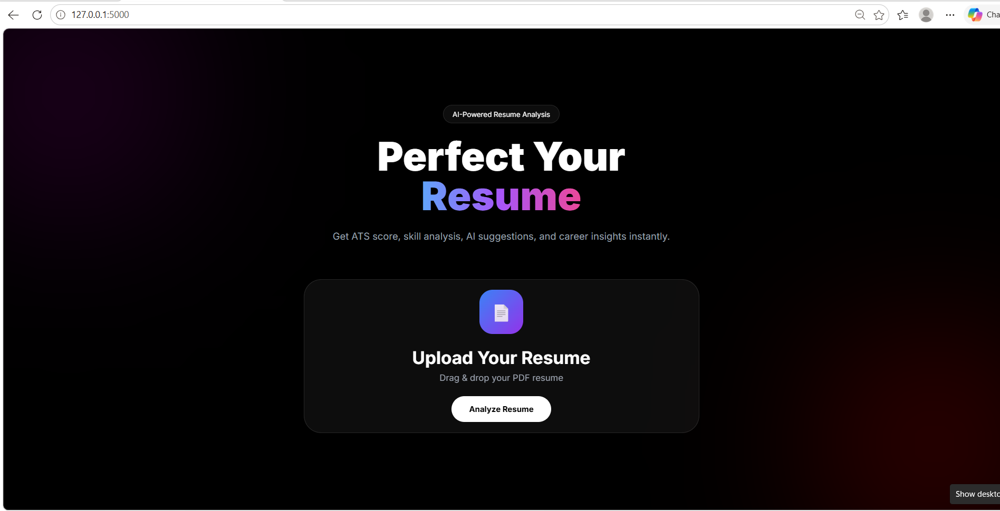

# 🚀 AI Resume Analyzer — Smart Career Assistant Powered by AI

> “Most resume tools just scan. This one understands.”

## 🧠 Problem Statement

Thousands of students apply for jobs every day, but many resumes:

* ❌ Fail ATS screening
* ❌ Miss important industry skills
* ❌ Don’t match job requirements
* ❌ Get rejected before reaching recruiters

As a result, even talented candidates lose opportunities.

---

# 💡 Solution

AI Resume Analyzer is an intelligent web application that analyzes resumes using AI and NLP techniques to provide:

* ✅ ATS-style resume analysis
* ✅ Skill detection
* ✅ Smart improvement suggestions
* ✅ Resume scoring
* ✅ Career-focused feedback

This platform helps students optimize resumes for placements and industry expectations.

---

# ✨ Key Features

### 🔹 AI-Powered Skill Detection

Detects technical skills intelligently using NLP techniques instead of simple keyword matching.

### 🔹 ATS Resume Analysis

Analyzes resumes similarly to Applicant Tracking Systems used by companies.

### 🔹 Smart Resume Feedback

Provides actionable suggestions to improve resume quality.

### 🔹 Resume Scoring System

Generates resume scores based on detected skills and relevance.

### 🔹 Placement-Focused Design

Built specially for students preparing for internships and placements.

### 🔹 Modern Responsive UI

Beautiful and interactive frontend with professional dashboard design.

---

# 🔍 How It Works

1️⃣ User uploads resume (PDF)


2️⃣ Resume text extracted using PDF parser


3️⃣ NLP processing cleans and analyzes content


4️⃣ Skills matched with intelligent dataset


5️⃣ Resume score calculated


6️⃣ AI feedback generated instantly

---

# 🛠 Tech Stack

## Frontend

* HTML5
* CSS3
* JavaScript

## Backend

* Python
* Flask
* Flask-CORS

## Database

* MongoDB

## AI / NLP

* NLTK
* spaCy

## Other Tools

* PyPDF2
* REST APIs
* Git & GitHub

---

# 📊 Example Output

### ✅ Skills Detected

* Python
* SQL
* Machine Learning
* Flask

### 📈 Resume Score

75 / 100

### 💡 Suggestions

* Add cloud technologies like AWS
* Improve project descriptions
* Add more quantified achievements

---

# 🎯 Real-World Impact

This project helps students:

* Improve resume quality
* Increase ATS compatibility
* Understand missing skills
* Prepare better for placements
* Reduce resume rejection chances

---

# 🔮 Future Enhancements

 🔹 AI Resume Rewriting
 🔹 Job Role Based Analysis
 🔹 Interview Question Generator
 🔹 LinkedIn Optimization
 🔹 Job Recommendation System
 🔹 AI Career Assistant Chatbot

---

# 🧩 Project Structure

```bash
AI-Resume-Analyzer/
│
├── backend/
│   ├── app.py
│   ├── services/
│   └── templates/
│
├── frontend/
├── uploads/
├── static/
└── README.md
```

---

# ⚙️ Installation & Setup

```bash
# Clone repository
git clone https://github.com/your-username/AI-Resume-Analyzer.git

# Open project
cd AI-Resume-Analyzer

# Create virtual environment
python -m venv .venv

# Activate virtual environment
# Windows
.venv\Scripts\activate

# Install dependencies
pip install -r requirements.txt

# Run Flask app
python app.py
```

---

# 📸 Screenshots

### 🏠 Home Page


### 📤 Upload Resume


### 📊 Result Page


---

# 👩‍💻 About Me

Hi, I’m **Nitisha Mali** 👋

🎓 Final Year AIML Student at RCPIT
💻 Passionate about AI, Backend Development, and Real-World Problem Solving
🚀 Building impactful AI-powered applications for students and placements

---

# ⭐ Support

If you found this project useful:

* ⭐ Star this repository
* 🍴 Fork the project
* 📢 Share with others

---

# 🌟 Why This Project Matters

> “This is not just a project — it’s a step toward solving real hiring and placement challenges using AI.”

Let’s help more students get placed 🚀
